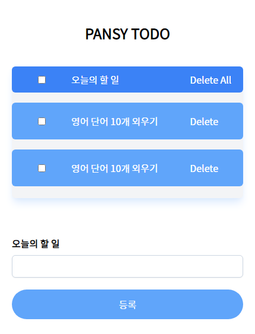

오늘부터 리액트 학습을 시작했습니다.
지금까지 경험해 본 바로는 책도 좋고 인터넷 강의도 좋지만, 뭐라도 하나 만들어보는 게
가장 빠르게 습득할 수 있었던 것 같습니다. 책을 본 후에 만드는 게 아니라, 만들어 보면서 인터넷 강의와 책을 참고하는 방식이 저에겐 잘 맞는 것 같습니다.

그래서 React 첫 프로젝트를 뭘 만들어볼까 고민하다가, 간단하면서도 참고할 강의도 있는 할 일 리스트를 만들어보기로 했습니다.
일단 오늘은 피그마로 와이어 프레임을 짜보고 바로 리액트 프로젝트를 만들어서 레이아웃을 작성해 봤습니다.

프론트를 해보는 건 이번이 처음이라 그런지 솔직히 간단한 레이아웃 배치도 어려웠습니다.
[CSS Flex](https://studiomeal.com/archives/197)라는 것을 찾아보면서 열심히 배치해 봤고,
CSS는 tailwindcss를 사용해서 꾸몄습니다.

이후에 생각 중인 기능은 다음과 같습니다.

- 기본적인 CRUD 기능
- 전체 체크
- 전체 삭제
- 체크 시 글자를 가운데로 줄 긋기
- 드래그 앤 드롭으로 위치 변경

그리고 노드로 API도 만들어서 데이터베이스에 데이터를 저장하고 읽어오도록 해 볼 생각입니다.
