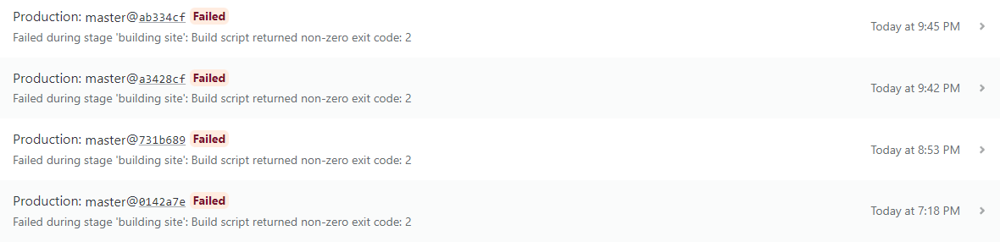

<!--    -->

오늘은 자바스크립트 프로토타입에 대해서 학습하고 정리했습니다.

예전에 사놓고 묵혀놨던 [인사이드 자바스크립트](http://www.yes24.com/Product/Goods/11781589)라는 책을 보고 정리했습니다.

솔직히 내용이 깊고 좋긴 하지만, 아직 저에겐 너무 어려운 것 같습니다.

그래도 실력을 키우려면 동작 원리와 관련된 책 한 권쯤은 읽어봐야겠다고 생각하고 있었기 때문에, 조금씩이라도 꾸준히 읽어봐야겠습니다.

[프로그래밍 > Javascript > 프로토타입](http://coldrain-f.netlify.app/programming/Javascript/프로토타입)  
[알고리즘 > 프로그래머스 > Lv.1 > 소수 찾기](http://coldrain-f.netlify.app/algorithm/프로그래머스/Lv.%201/소수-찾기)

### 블로그 배포 이슈

공부한 내용 정리도 끝났고, 오늘치 TIL도 다 적어서 배포하고 쉬려고 했는데 Netlify 배포가 계속해서 실패하는 문제가 발생했습니다.

원인 분석을 하기 위해서 배포 로그 분석을 해봤고, 다음과 같은 로그를 발견했습니다.

`7:18:37 PM: Error: Image static/img/programming/javascript/prototype_console.png used in programming/Javascript/02.프로토타입.md not found.`

뭔가 이미지를 못 불러오나 싶어서 절대 경로를 상대 경로로 바꿔도 보고,
파일명에 언더 스코어(\_)를 쓰면 안 되나 해서 하이픈(-)으로 변경도 해봤는데 계속해서 실패했습니다.

그리고 파일의 확장자는 대문자 `PNG`로 되어있고 마크다운 문서엔 소문자 `png`로 해놨길래 이게 문제인가 싶어서 맞춰도 봤으나... 이것도 실패했습니다.

결국 삽질 끝에 해결하긴 했습니다. 파일의 확장자는 대문자든 소문자든 상관이 없었고, 마크다운 문서는 무조건 확장자를 소문자로 표기했어야 했습니다.
