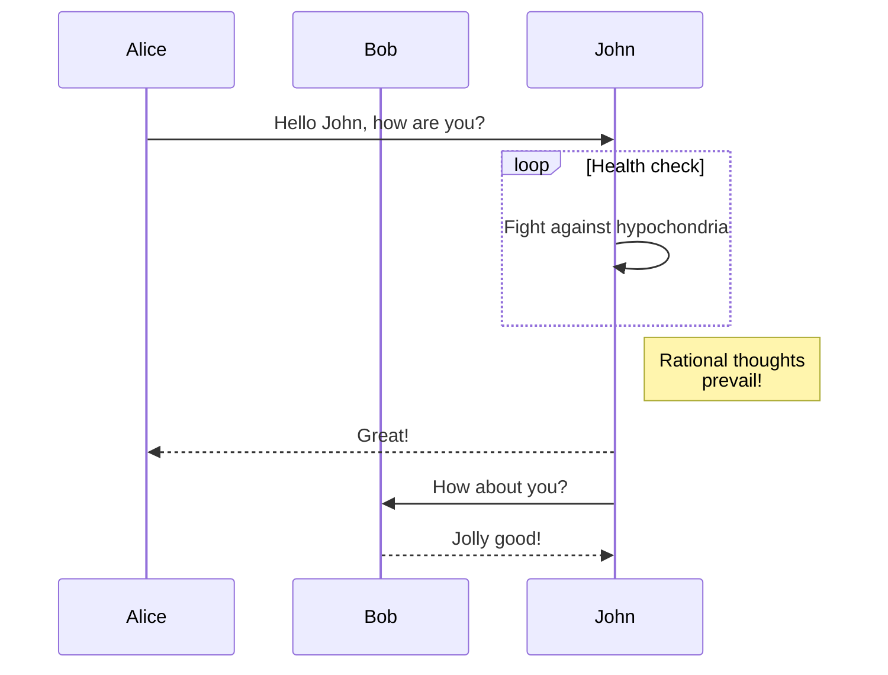

<!--    -->

당분간은 퇴근 후 자료구조 공부를 해볼까 합니다.

그리고 오늘은 그래프(Graph)에 대해서 학습하고 정리했습니다.

양이 많아서 오늘은 무리고, 내일 이어서 정리하려고 합니다.

마침 Docusaurus 2.2v로 업그레이드하면서 다이어그램 기능이 생겨서 활용해보고 있습니다.

[CS 지식 > 자료구조 > 그래프](https://coldrain-f.netlify.app/cs/dataStructure/그래프)  

#### 다이어그램 예시
