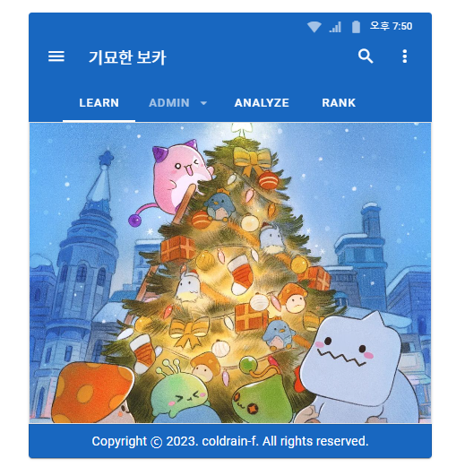
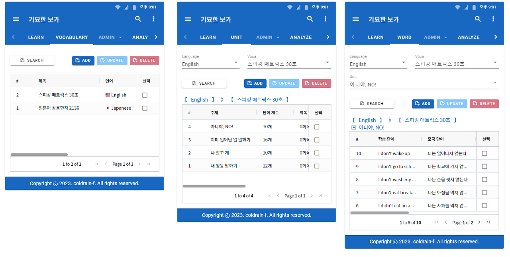
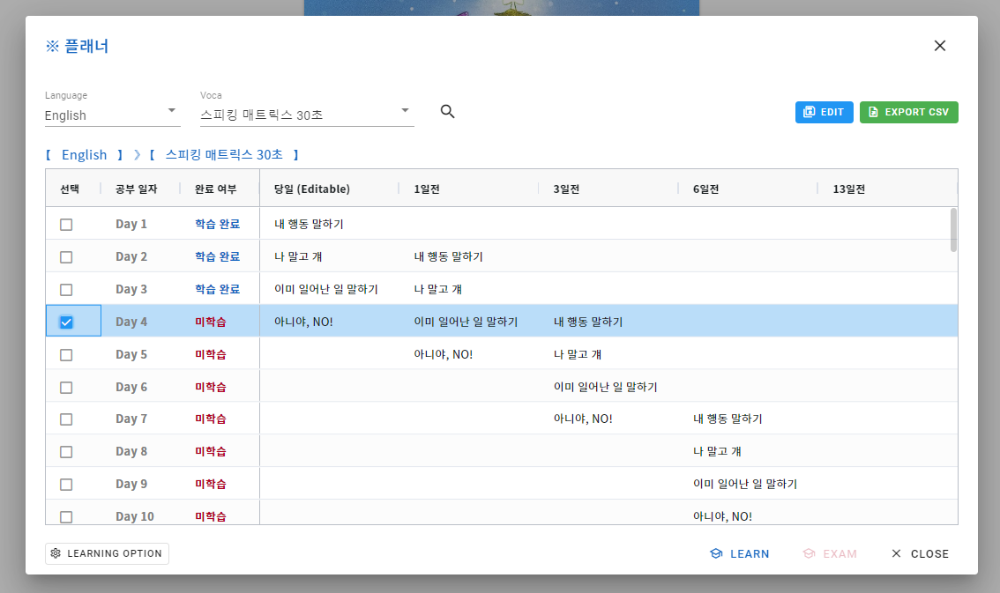
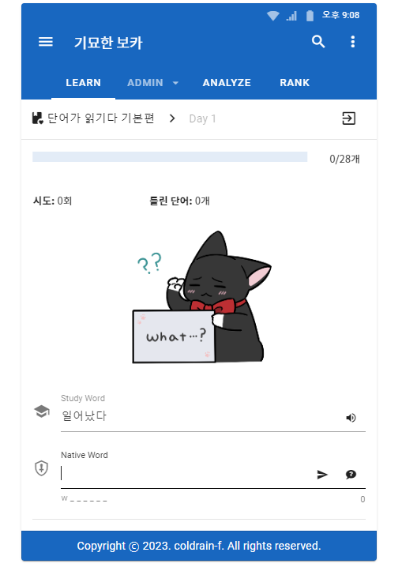
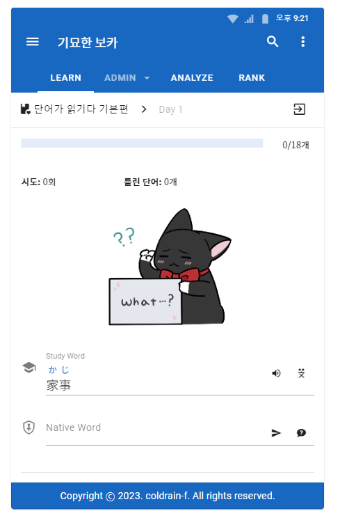

### 토이 프로젝트를 시작한 계기

이전에는 국비지원 학원이나 항해 99와 같은 부트캠프에서 짧은 기간 동안에만 진행되는 프로젝트만 경험했었습니다.

교육 기관에서 진행하는 팀 프로젝트의 장점은 다양한 사람들과 역할을 나누고 협업을 할 수 있다는 점이라고 생각합니다. 이 부분은 굉장히 좋은 경험이 됐었고 좋았습니다.

하지만 항상 기간이 짧고 데드 라인이 정해져 있다 보니 매번 서두르게 돼버려서 구현에만 급급했고 중복 코드나 버그 투성이의 냄새나는 코드가 잔뜩 생기게 되었습니다.

교육을 수료한 이후에는 팀원들에게 있어서 더 이상 프로젝트는 최우선 우선순위가 아니게 되기 때문에 프로젝트가 끝나더라도 전체적으로 코드를 리팩터링 한다거나 추가 기능을 넣기가 어려웠습니다.

수료 이후에도 프로젝트를 계속 끌고 가는 팀원들도 있었을 거라 생각합니다. 그저 그런 상황이 저에겐 찾아오지 않았기 때문에 아쉬웠을 뿐입니다.

이번 토이 프로젝트는 이러한 이유들 때문에 시작했습니다. 프론트 쪽도 한 번쯤은 해보고 싶었고 올해부터는 영어나 일본어 단어도 조금씩 외워보면 좋겠다는 생각을 갖고 있었기 때문에 단어를 암기할 수 있는 웹 애플리케이션을 만들어보자는 생각으로 시작했습니다.

### 진행은 어떻게?

기획, 프론트, 백엔드를 모두 혼자 하려다 보니 프로젝트 규모에 비해서 삽질을 굉장히 많이 했습니다. 한 번도 접해본 적 없는 Vue.js로 화면을 만들기 위해서 프로젝트를 구성하여 어찌어찌 개발을 시작했지만 막힐 때마다 물어볼 사람도 없어서 공식 문서와 구글에 의존하면서 더딘 속도로 개발했습니다.

디자인과도 연이 없어서 어떻게 해야 할지 한참을 고민하고 있던 차에 다행히 Vuetify라는 좋은 Vue 컴포넌트 프레임워크를 발견하고 나서는 열심히 문서를 뒤져가며 화면을 만들었습니다.

서버는 개인적으로 꾸준히 공부해 왔던 Spring Boot + JPA, QueryDSL을 사용했기 때문에 Vue.js에 비해서는 크게 막히진 않았던 것 같습니다.

### 그래서 만든 기능들은?

사용자는 관리자 화면에서 단어장을 등록합니다. 그리고 단어장 하나당 여러 카테고리를 등록할 수 있고, 카테고리별로 외우고 싶은 단어들을 추가할 수 있습니다. 웹이지만 앱처럼 만들려다 보니 화면이 너무 좁아서 기획한 대로 만들진 못했습니다.

학습하고자 하는 단어장을 생성하고 플래너로 넘어오면 생성된 단어장의 카테고리를 당일 컬럼에 셀렉트 박스를 통해서 추가할 수 있습니다. 추가하면 자동으로 복습 주기가 완성됩니다.

복습 주기는 1/4/7/14 학습법을 채택하여 당일 학습 분량 + 1일 전 복습 + 3일 전 복습 + 6일 전 복습 + 13일 전 복습이 자동으로 채워집니다. 에빙하우스의 망각 곡선을 기반하여 자연스럽게 단기 기억에서 장기 기억으로 흐를 수 있도록 하고 싶었고 복잡한 학습 플래너를 간편하게 생성해주고 싶었습니다.

만약 카테고리당 학습 단어가 5개씩 등록되어 있다면 당일 학습 분량(5개) + 1일 전 복습(5개) + 3일 전 복습(5개) + 6일 전 복습(5개) + 13일 전 복습(5개)으로 14일 차부터는 하루에 총 25개의 단어를 학습하게 됩니다. 복습의 양이 많아 보이지만 당일과 1일 전을 제외하고는 모두 2 회독 이상씩 진행한 상태이기 때문에 굉장히 빠른 속도로 넘길 수 있습니다.

플래너의 학습 옵션에서 영어를 출제하고 한국어로 답을 입력할지, 한국어를 출제하고 영어로 답을 입력할지에 대한 학습 스타일을 선택할 수 있습니다. 이외에도 복습을 안 하고 당일 단어만 학습할 수 있는 옵션이나 TTS(Text To Speech) 목소리 선택 등 다양한 옵션들이 존재합니다.

필요한 옵션들을 설정하고 학습할 공부 일자(Day 1, Day 2...)를 선택해서 LEARN 버튼을 클릭하면 학습 화면으로 넘어갑니다. 모든 단어의 학습이 끝나면 틀린 단어를 모아서 랜덤으로 섞은 뒤 시도 횟수가 1 증가하여 한번 더 학습이 진행되고, 틀린 단어가 하나도 없다면 그제야 학습이 완전히 종료되고 플래너에서도 해당 공부 일자는 학습 완료로 표시됩니다.

고양이 그림은 사용자 입력을 기다리는 경우, 문제를 틀린 경우, 맞은 경우에 표정과 몸짓이 달라집니다. 그림을 잘 그리는 제 지인이 그려줬습니다.

일본어 단어장을 학습하는 경우엔 한자 위에 후리가나(Furigana)를 표시할 수 있는 아이콘 버튼이 추가됩니다. 클릭하면 한자 위에 후리가나가 표시됩니다.

### 앞으로의 계획

"빨리 만들어서 단어를 잔뜩 외워야지!"라는 생각을 갖고 급한 마음으로 프로젝트에 임하다 보니 정해진 일정이나 데드 라인은 없었지만 항상 급하게 만들고 있는 자신을 볼 수 있었습니다.

어찌어찌 만들었고 개인적으로도 나름 만족스럽게 사용하고 있긴 하지만.. 냄새나는 코드들이 계속해서 쌓여가다 보니 내용물이 상당히 불만족스럽게 되어버렸습니다. 그래서 앞으로는 기능 추가보다는 코드 리팩터링을 진행해 볼 생각입니다.

가장 먼저 타입스크립트(Typescript)로 마이그레이션을 진행해 보면서 전체적으로 코드를 정리해보고자 합니다. 프로젝트가 진행되면 진행될수록 코드가 계속해서 길어지는데 자바스크립트는 자동 완성이 잘 안 되다 보니 변수명이나 함수명을 까먹으면 항상 코드를 다 뒤져보거나 검색해서 확인해야 했었고 타입을 바로바로 확인할 수 없다는 점이 너무 답답했기 때문입니다.

타입스크립트로 마이그레이션이 끝나면 이번 프로젝트에서 못했던 테스트 코드도 짜보고, 로그인 기능과 CI/CD도 진행해 볼 생각입니다. 욕심을 좀 더 부리자면 Chat GPT 도입(질문 용도), 학습 분석, 랭킹, 단어장 공유, 스터디(함께 학습) 등의 기능들을 추가 개발해보고 싶습니다.

처음에는 이걸 어떻게 만들지 라는 생각으로 많이 막막했지만 하다 보니 개발에 대한 흥미도 조금씩 붙었고 성취감과 프로젝트에 대한 애착도 많이 생긴 것 같아서 시작하길 정말 잘했다는 생각이 듭니다.
