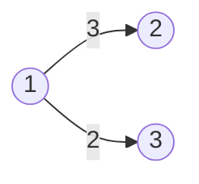
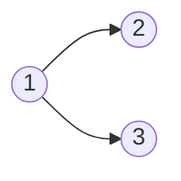
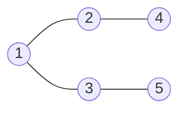

### 시작하기에 앞서

:::caution 주의
해당 블로그의 모든 문서는 학습한 내용을 제 방식으로 정리하여 작성하고 있습니다.  
순수 창작물도 아니고, 틀린 내용이 있을 수 있으므로 참고하고 읽어주시면 감사하겠습니다.
:::
 

## 그래프 용어

그래프의 각각의 요소를 정점(Vertex)이라고 부르고,

정점과 정점을 잇는 선을 간선(Edge)이라고 부릅니다.

그리고 간선에 값이 적혀 있는 경우도 종종 볼 수 있는데,
이러한 값을 간선의 가중치(Weight)라고 부릅니다.

위 그래프를 보면 1, 2, 3이 정점이 되고, 연결된 선들이 간선이라고 볼 수 있습니다. 

그리고, 1 -> 2 방향의 3과 1 -> 3 방향의 2가 가중치가 됩니다.

## 그래프의 종류
- 방향 그래프
- 무방향 그래프
- 연결 그래프
- 비 연결 그래프(단절 그래프)

### 방향 그래프

그래프는 방향 그래프와 무방향 그래프로 분류하기도 합니다.

방향 그래프는 말 그대로 방향이 있는 그래프이고, 표시된 방향으로만 이동할 수 있습니다.

표시된 방향이 하나라도 존재한다면 방향 그래프라고 볼 수 있습니다.

위 그래프에서는 1번 정점에서 2번 정점으로는 이동할 수 있지만, 반대로 2번 정점에서 1번 정점으로는 이동할 수 없습니다.

### 무방향 그래프

무방향 그래프는 딱히 정해진 방향이 없어서 그래프 내 모든 길을 양방향으로 이동할 수 있습니다.

1번 정점에서 2번 정점으로 이동할 수 있고, 반대로 2번 정점에서 1번 정점으로도 이동할 수 있습니다.

## 연결 그래프
모든 정점에 대해서 어느 두 정점을 선택해도 갈 수 있는 경로가 존재하는 그래프를 연결 그래프라고 합니다.

## 비 연결 그래프
연결 그래프가 아닌 경우를 비 연결 그래프라고 합니다.

## 차수
- 차수(Degree)
- 진입 차수(In-degree)
- 진출 차수(Out-degree)

특정 정점과 연결된 정점의 수를 차수(Degree)라고 부릅니다.

1 -> 4

4번 정점으로 들어올 수 있는 정점은 1번 정점이므로,
진입 차수는 1번 정점 1개라고 볼 수 있습니다.

1 -> 4 -> 3

4번 정점에서 나갈 수 있는 정점은 3번 정점 하나이므로,
진출 차수는 3번 정점 1개라고 볼 수 있습니다.

## 사이클
특정 정점에서 출발해서 다시 본래 정점으로 돌아올 수 있다면,
그래프에 사이클(Cycle)이 있다고 합니다.

## 그래프의 구현 방법
- 인접 행렬
- 인접 리스트

그래프를 구현하는 방법은 크게 두 가지입니다.
### 인접 행렬
- 정점의 수: |V|

인접 행렬은 |V| * |V| 크기의 2차원 배열을 만들어서 연결 관계를 표현합니다.

1에서 2로 갈 수 있는 길이 있다면 1행 2열의 값을 1로, 가는 길이 없다면 0으로 채웁니다. 

### 인접 리스트

인접 리스트는 정점의 개수만큼 연결 리스트를 만들고,

연결 리스트에 특정 정점과 인접해있는 정점들의 정보를 담는 방식으로 구현합니다.

[3] -> 2 -> 5

3번 정점은 2번 정점으로 갈 수 있고, 5번 정점으로도 갈 수 있습니다.
