### 시작하기에 앞서

:::caution 주의
해당 블로그의 모든 문서는 학습한 내용을 제 방식으로 정리하여 작성하고 있습니다.  
순수 창작물도 아니고, 틀린 내용이 있을 수 있으므로 참고하고 읽어주시면 감사하겠습니다.
:::
 

## 그래프 용어
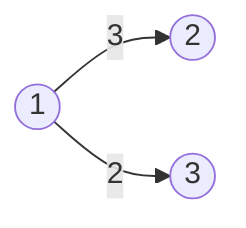

그래프 각각의 요소를 정점(Vertex)이라고 부르고,

정점과 정점을 잇는 선을 간선(Edge)이라고 부릅니다.

그리고 간선에 값이 적혀 있는 경우도 종종 볼 수 있는데,
이러한 값을 간선의 가중치(Weight)라고 부릅니다.

위 그래프를 보면 1, 2, 3이 정점이 되고, 연결된 선들이 간선이라고 볼 수 있습니다. 

그리고, 1 -> 2방향의 3과 1 -> 3방향의 2가 가중치가 됩니다.

## 그래프의 종류
- 방향 그래프
- 무방향 그래프
- 연결 그래프
- 비 연결 그래프(단절 그래프)

### 방향 그래프
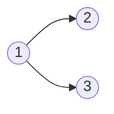
그래프는 방향 그래프와 무방향 그래프로 분류하기도 합니다.

방향 그래프는 말 그대로 방향이 있는 그래프이고, 표시된 방향으로만 이동할 수 있습니다.

표시된 방향이 하나라도 존재한다면 방향 그래프라고 볼 수 있습니다.

위 그래프에서는 1번 정점에서 2번 정점으로는 이동할 수 있지만, 반대로 2번 정점에서 1번 정점으로는 이동할 수 없습니다.

### 무방향 그래프
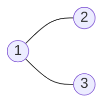
무방향 그래프는 딱히 정해진 방향이 없어서 그래프 내 모든 길을 양방향으로 이동할 수 있습니다.

1번 정점에서 2번 정점으로 이동할 수 있고, 반대로 2번 정점에서 1번 정점으로도 이동할 수 있습니다.

## 연결 그래프
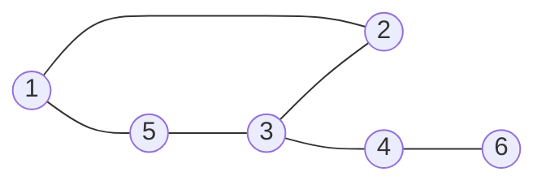
모든 정점에 대해서 어느 두 정점을 선택해도 갈 수 있는 경로가 존재하는 그래프를 연결 그래프라고 합니다.

위 그래프는 어느 두 정점을 선택하더라도 갈 수 있으므로 연결 그래프입니다.

## 비 연결 그래프
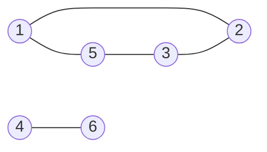

연결 그래프가 아닌 경우를 비 연결 그래프라고 합니다.

위 그래프는 5번 정점과 4번 정점을 선택하면 갈 수 있는 경로가 없기 때문에 비 연결 그래프입니다.

비 연결 그래프는 단절 그래프라고 부르기도 합니다.

## 차수
- 차수(Degree)
- 진입 차수(In-degree)
- 진출 차수(Out-degree)

### 차수

특정 정점과 연결된 정점의 수를 차수(Degree)라고 부릅니다.

위 그래프에서는 1번 정점은 2번 정점과 3번 정점에 연결되어 있으므로 1번 정점의 차수는 2가 됩니다.

그리고, 2번 정점은 1번 정점하고만 연결되어 있으므로 2번 정점의 차수가 1이 됩니다.

3번 정점 역시 2번 정점과 동일하게 차수가 1이 됩니다.

### 진입 차수
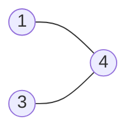
진입 차수는 특정 정점에 들어올 수 있는 정점의 개수를 말합니다.

4번 정점으로 들어올 수 있는 정점은 1번 정점과 3번 정점 2개이므로,

4번 정점의 진입 차수는 2가 됩니다.

### 진출 차수
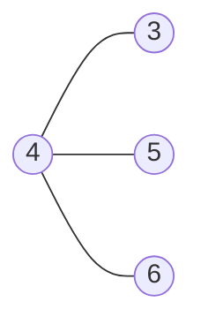

진출 차수는 특정 정점에서 나갈 수 있는 정점의 개수를 말합니다.

4번 정점에서 나갈 수 있는 정점은 3번, 5번, 6번 정점 3개입니다.

따라서 정점 4의 진출 차수는 3이 됩니다.

## 사이클
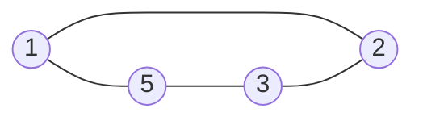

특정 정점에서 출발해서 다시 본래 정점으로 돌아올 수 있다면,

그래프에 사이클(Cycle)이 있다고 합니다.

해당 그래프는 사이클이 있습니다. 1번 정점에서 출발해서 다시 1번 정점으로 올 수 있기 때문입니다.

- 방법 1) 1 -> 5 -> 3 -> 2 -> 1
- 방법 2) 1 -> 2 -> 3 -> 5 -> 1

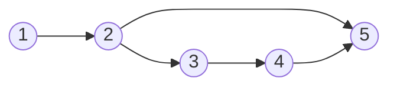
위 그래프는 사이클이 없는 그래프입니다.

어떤 정점에서 출발해도 다시 본래 정점으로 돌아올 방법이 없기 때문입니다.

## 그래프의 구현 방법
- 인접 행렬
- 인접 리스트

그래프를 구현하는 방법은 크게 인접 행렬과 인접 리스트 두 가지입니다.

### 인접 행렬
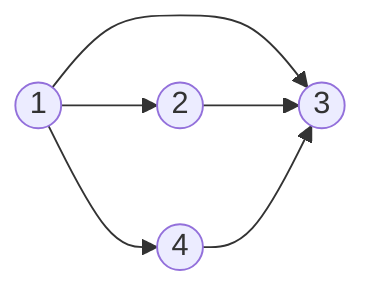
- 정점의 수: |V|

인접 행렬은 |V| * |V| 크기의 2차원 배열을 만들어서 연결 관계를 표현합니다.

1에서 2로 갈 수 있는 길이 있다면 1행 2열의 값을 1로, 가는 길이 없다면 0으로 채웁니다. 

#### 인접 행렬 예시
|     |1 |2 |3 |4 |
|-----|--|--|--|--|
| **1** |0|1|1|1|
| **2** |0|0|1|0|
| **3** |0|0|0|0|
| **4** |0|0|1|0|
1번 정점은 2, 3, 4번 정점에 갈 수 있으므로 1행 2열, 3열, 4열을 1로 채웁니다.

그리고 2번 정점은 3번 정점에 갈 수 있으므로 2행 3열을 1로 채웁니다.

3번 정점은 갈 수 있는 정점이 없으므로 모두 0이 됩니다.

4번 정점은 3번 정점에 갈 수 있으므로 4행 3열을 1로 채웁니다.

이런 식으로 2차원 배열을 만들어서 연결 관계를 표현하는 방식을 인접 행렬이라고 합니다.

### 인접 리스트

인접 리스트는 정점의 개수만큼 연결 리스트를 만들고,

연결 리스트에 특정 정점과 인접해있는 정점들의 정보를 담는 방식으로 구현합니다.
#### 인접 리스트 예시
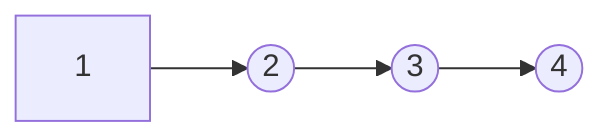
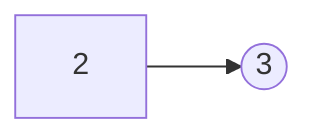
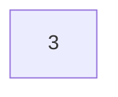
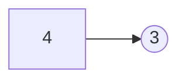
인접 리스트는 이런 식으로 연결 리스트로 표현합니다.

1번 정점은 2, 3, 4번 정점에 갈 수 있고,

2번 정점은 3번 정점에, 3번 정점은 갈 수 있는 정점이 없고,

4번 정점은 3번 정점에 갈 수 있음을 나타냅니다.
