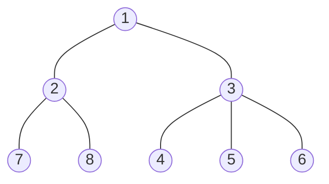

### 시작하기에 앞서

:::caution 주의
해당 블로그의 모든 문서는 학습한 내용을 제 방식으로 정리하여 작성하고 있습니다. <br/>
순수 창작물도 아니고, 틀린 내용이 있을 수 있으므로 참고하고 읽어주시면 감사하겠습니다.
:::
<br/>

## 그래프 탐색

- DFS(Depth First Search)
- BFS(Breadth First Search)

그래프 탐색 방법은 크게 두 가지로,

DFS와 BFS가 있습니다. 순서대로 깊이 우선 탐색과 너비 우선 탐색입니다.

둘 다 알아볼 생각이지만 일단은 깊이 우선 탐색, DFS부터 알아보도록 하겠습니다.

어느 정도 그래프에 대한 이해도가 필요하므로, 아직 그래프에 대해서 전혀 모르고 있다면

[CS 지식 > 자료구조 > 그래프](https://coldrain-f.netlify.app/cs/dataStructure/%EA%B7%B8%EB%9E%98%ED%94%84)를 먼저 읽어보시길 권장해 드립니다.

그리고 구현은 Python을 통해서 할 생각입니다.

Python의 기초 문법 등은 알고 있다고 가정하므로 언어의 문법에 대해서는 따로 설명하지 않겠습니다.

## DFS - 깊이 우선 탐색

DFS는 더 이상 갈 수 없을 때까지 최대한 깊이 들어가 보는 그래프 탐색 방법입니다.
최대한 깊이 들어가 보고, 더 이상 갈 수 있는 길이 없으면 다시 돌아와서 안 가본 다른 경로로 깊이 들어가 보는 것을 반복합니다.

그래프의 모든 정점을 방문하고자 하는 경우에 DFS를 사용할 수 있습니다.

이렇게만 설명해서는 이해하기 어려울 테니, 도표를 이용해서 한 번 자세히 보도록 하겠습니다.

하지만 들어가기 전에, 일단 3가지 정도만 기억하고 가면 좋을 것 같습니다.

- 그래프 표현 방법에는 인접 행렬과 인접 리스트 크게 두 가지 정도가 있다.
- 이미 방문했던 정점은 다시 방문하지 않도록 방문 여부를 체크해야 한다.
- 보통 재귀함수나, 스택 자료구조를 통해서 구현할 수 있는데, 주로 재귀를 통해서 구현한다.

### 그래프 표현

먼저 인접 행렬로 그래프를 표현해서 DFS를 진행해보겠습니다.

표현하고자 하는 그래프는 무방향 그래프로, 다음과 같습니다.



<br/>

```python title='그래프 표현' showLineNumbers
MAX_VERTEX_NUM = 8
graph = [
    [0 for _ in range(MAX_VERTEX_NUM  + 1)]
    for _ in range(MAX_VERTEX_NUM  + 1)
]
```

해당 그래프를 인접 행렬로 표현하기 위해서 먼저 2차원 리스트를 만들어 줍니다.

변수 `MAX_VERTEX_NUM`은 정점의 총 개수고, `MAX_VERTEX_NUM + 1`을 해주는 이유는

행과 열의 인덱스 번호를 1번에서 8번까지를 쓰고 싶은데, 정점의 수에 +1을 해주지 않으면

배열의 특성상 0번부터 7번까지만 사용할 수 있기 때문입니다.

```python title="연결 표현" showLineNumbers
graph[7][8] = 1
graph[8][7] = 1
```

예를 들어서, 7번 정점과 8번 정점이 연결되어 있음을 표현하려면 위와 같이 작성해야 하는데,

+1을 하지 않으면 8번은 범위를 벗어난 인덱스이므로 에러가 발생하기 때문입니다.

위 그래프의 연결 관계를 표현해 보겠습니다.

```python showLineNumbers
MAX_VERTEX_NUM = 8
graph = [
    [0 for _ in range(MAX_VERTEX_NUM  + 1)]
    for _ in range(MAX_VERTEX_NUM  + 1)
]

a_points = [1, 1, 2, 2, 3, 3, 3]
b_points = [2, 3, 7, 8, 4, 5, 6]

for a, b in zip(a_points, b_points):
    graph[a][b] = 1
    graph[b][a] = 1
```

이렇게 작성하고 나면 다음과 같이 그래프의 연결 관계가 표현된 인접 행렬이 완성됩니다.

#### 그래프의 연결 관계가 표현된 인접 행렬


<br />

|       | 1   | 2   | 3   | 4   | 5   | 6   | 7   | 8   |
| ----- | --- | --- | --- | --- | --- | --- | --- | --- |
| **1** | 0   | _1_ | _1_ | 0   | 0   | 0   | 0   | 0   |
| **2** | _1_ | 0   | 0   | 0   | 0   | 0   | _1_ | _1_ |
| **3** | _1_ | 0   | 0   | _1_ | _1_ | _1_ | 0   | 0   |
| **4** | 0   | 0   | _1_ | 0   | 0   | 0   | 0   | 0   |
| **5** | 0   | 0   | _1_ | 0   | 0   | 0   | 0   | 0   |
| **6** | 0   | 0   | _1_ | 0   | 0   | 0   | 0   | 0   |
| **7** | 0   | _1_ | 0   | 0   | 0   | 0   | 0   | 0   |
| **8** | 0   | _1_ | 0   | 0   | 0   | 0   | 0   | 0   |

### 방문 여부 체크

인접 행렬을 통해서 그래프를 표현하는 방법까지 살펴봤습니다.
이번에는 앞서 설명했던 방문한 정점은 다시 방문하지 않도록 방문 여부를 체크하는 방법에 대해서 알아보도록 하겠습니다.

**...작성 필요**

### 깊이 우선 탐색 구현

**...작성 필요**

## 최종 DFS 코드

```python title='최종 DFS 코드' showLineNumbers
MAX_VERTEX_NUM = 8
graph = [
    [0 for _ in range(MAX_VERTEX_NUM  + 1)]
    for _ in range(MAX_VERTEX_NUM  + 1)
]
visited = [False for _ in range(MAX_VERTEX_NUM + 1)]

def dfs(vertex):
    for curr_v in range(1, MAX_VERTEX_NUM + 1):
        if graph[vertex][curr_v] != 1 or visited[curr_v]:
            continue

        print(curr_v)
        visited[curr_v] = True
        dfs(curr_v)


a_points = [1, 1, 2, 2, 3, 3, 3]
b_points = [2, 3, 7, 8, 4, 5, 6]

for a, b in zip(a_points, b_points):
    graph[a][b] = 1
    graph[b][a] = 1

visited[1] = True
print(1)
dfs(1)
```
