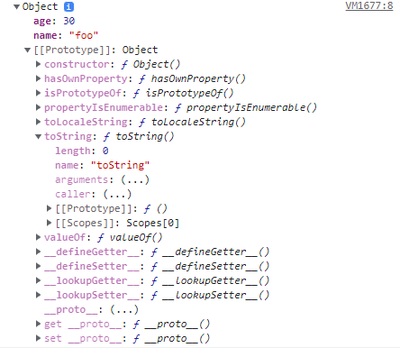

### 시작하기에 앞서

:::caution 주의
해당 블로그의 모든 문서는 학습한 내용을 제 방식으로 정리하여 작성하고 있습니다. <br/>
순수 창작물도 아니고, 틀린 내용이 있을 수 있으므로 참고하고 읽어주시면 감사하겠습니다.
:::

## 프로토타입

자바스크립트의 모든 객체는 자신의 부모 역할을 하는 객체와 연결되어 있습니다.
이러한 부모 객체를 자바스크립트에서는 프로토타입이라고 하고, 부모 객체의 프로퍼티를 마치 자신의 것처럼 사용할 수 있습니다.

```javascript showLineNumbers
const foo = {
  name: "foo",
  age: 30,
};

// highlight-next-line
console.log(foo.toString());

console.dir(foo);
```

객체 리터럴 방식으로 foo 객체를 생성하고, 이 객체의 toString() 메서드를 사용 했습니다.
하지만 살펴보면 foo 객체는 toString이 없으므로 에러가 발생해야 하지만 에러가 발생하지 않습니다.
그 이유는 foo 객체의 부모 객체와 같은 역할을 수행하는 프로토타입에 toString()이 있고,
자바스크립트는 프로토타입의 프로퍼티를 자신의 것처럼 사용할 수 있기 때문입니다.

ECMAScript 명세서에는 자바스크립트의 모든 객체는 자신의 프로토타입을 가리키는 `[[Prototype]]`이라는 숨겨진 프로퍼티를 가진다고 설명합니다.
크롬 브라우저에서는 `__proto__`가 숨겨진 `[[Prototpye]]` 프로퍼티를 의미합니다.

위 예시 코드에서처럼 객체 리터럴 방식으로 생성된 객체의 경우엔 `Object.prototype` 객체가 프로토타입 객체가 됩니다.
`Object.prototype` 객체는 `toString()`, `valueOf()`등의 자바스크립트 기본 내장 메서드가 포함되어 있습니다.

#### console.dir(foo)

<!--  -->
<!--  -->

<!--  -->

<!--  -->


`console.dir(foo)`의 결과입니다.
보면 foo 객체는 `[[Prototype]]`객체를 프로퍼티로 가지고 있는 것을 확인해 볼 수 있습니다.
이는 웨일 브라우저로 실행해본 결과이고, 크롬으로 확인해보면 `[[Prototype]]`이 아니라 `__proto__`으로 되어있습니다.

## 참고 문서

- [인사이드 자바스크립트 03 - 자바스크립트 데이터 타입과 연산자](http://www.yes24.com/Product/Goods/11781589)
