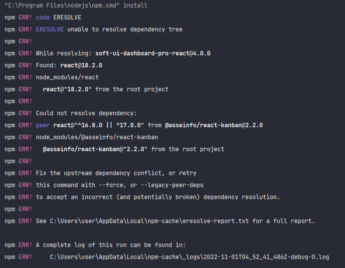

## 문제 발생


React 프로젝트를 실행하기 전에 `npm install`을 하는 과정에서

`ERESOLVE unable to resolve dependency tree` 에러가 발생했습니다.


## 해결 방안
```bash
npm install --save --legacy-peer-deps
```
`npm install` 뒤에 `--save --legacy-peer-deps` 부분을 추가해 주면서 문제를 해결했습니다.

뭔가 버전이 안 맞아서 의존성이 충돌 났었던 것 같습니다.

`--legacy-peer-deps` 옵션은 충돌을 무시하고 설치하고,

`--force`옵션은 필요한 경우 패키지 의존성을 위해 추가적인 패키지를 설치한다고 합니다.

